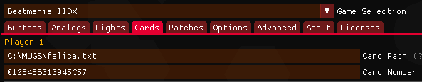

# CardReader

一个为 SEGA/Bemani 街机音游设计的、可以兼容任何 NFC 卡的读卡器固件！（这样就可以用学生卡公交卡登录了！）

## How it works / 实现方式

其实强制支持不同 NFC 卡的方式非常简单。因为 SEGA/Bemani 的游戏都是直接读了 Felica IDm 序列号发给服务器，所以如果想要让其他非 Felica 卡兼容的话，只需要把序列号转换成 Felica 的格式就可以了。具体的话，就是把 ID 垫零变成 8 字节，然后把前两个字节改成 0x01 0x2E 就可以了。

## Usage / 使用方法:

### 制作与固件烧录

1. 买一块 ESP32 开发板、一块 PN532 NFC 模块（我是直接买了[红月的 PCB ￥109](https://m.tb.cn/h.5RS0tuc?tk=jL1vW2UxDH3)，看起来好看一点还有 RGB 灯）
2. 把这个仓库 clone 下来
3. 下载 [PlatformIO Core](https://platformio.org/)，在 [PlatformIO Boards](https://docs.platformio.org/en/latest/boards/espressif32) 里面找到你的型号，然后编辑 `platformio.ini` 里面的 `board` 字段
4. 把 PN532 模块的 I2C_SDA、I2C_SCL、GND、VCC 连接到 ESP32 开发板上
5. 如果有 RGB 灯的话在 `src/main.cpp` 里面改一下 `setup()` 里面的 LED 引脚
6. `pio run -t upload -t monitor` 烧录之后测试

### 与音游连接

1. 如果你想玩 SEGA 的游戏，编辑 segatools.ini, 把设置改成如下：

```ini
[aime]
enable = 1
felicaPath = C:\MUGS\felica.txt  # 这里改成一个固定的 Felica.txt 路径, 所有游戏共享
felicaGen = 0
scan = 0x6B
```

2. 如果你想玩 Bemani 的游戏，在 Spice2x 里面设置 Felica.txt 路径，然后把 Insert Card 按钮映射成 "Naive" 0x6B (小键盘 +) 按键即可




3. 下载 Python, 安装 `pip install pyserial`，然后运行 `python receiver.py`，这样接上读卡器之后就可以自动转存卡片然后自动按下 Insert Card 按钮了

## Dependencies / 依赖:

* PN532 Library: https://github.com/Seeed-Studio/PN532/